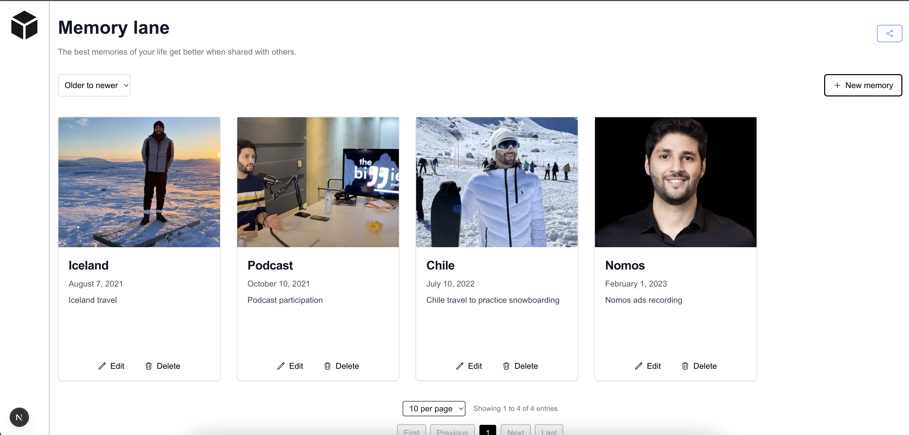

# Memory Lane Next JS

Memory lane is a simple application in Next.js that allows you to create a timeline of memories.



[Download the video demo](./docs/product-overview.mov)

### Directory Overview

- **`src/app/`**: Contains the main application code using Next.js App Router

  - `api/`: API routes for handling server-side operations
  - `actions/`: Server actions for database operations
  - `(memories)/create/`: Page for creating new memories
  - `(memories)/edit/`: Page for editing a memory
  - `(memories)/detail/`: Page for memory details
  - `(root)/page.tsx`: Main home page component (List memories)
  - `layout.tsx`: Application layout for all pages
  - `errors.tsx`: Handle unexpected application erros
  - `loading.tsx`: Handle application loadings

- **`src/components/`**: React components organized by purpose

   - `containers/`: Complex components with business logic
   - `ui/`: Reusable UI components

- **`src/context/`**: React Context providers for state management

  - `alert.tsx`: Global state management for alerts

- **`src/db/`**: Database-related files

  - `database.sqlite`: SQLite database file
  - `schema.ts`: Database schema definitions using Drizzle ORM

- **`src/hooks/`**: Custom React hooks

  - `useAlert.ts`: Hook for invoke alerts

- **`src/types/`**: TypeScript type definitions

  - `memory.ts`: Types related to memory entities

- **`src/utils/`**: Helper functions and utilities

  - `date.ts`: Date manipulation and formatting

- **`public/`**: Static assets and uploaded files
  - `uploads/`: Directory for storing uploaded images

### Key Technologies

- Next.js 14 (App Router)
- Drizzle ORM with SQLite
- TypeScript
- Server Actions for data mutations
- File upload handling

This project was bootstrapped with [`create-next-app`](https://nextjs.org/docs/app/api-reference/cli/create-next-app).

## Getting Started

First install the dependencies:

```bash
yarn
```

Then, run the migrations to create the SQLite database:

```bash
yarn migrate
```

Finally, run the development server:

```bash
yarn dev
```

Open [http://localhost:3000](http://localhost:3000) with your browser to see the result.

You can start editing the page by modifying `app/page.tsx`. The page auto-updates as you edit the file.

This project uses [`next/font`](https://nextjs.org/docs/app/building-your-application/optimizing/fonts) to automatically optimize and load [Geist](https://vercel.com/font), a new font family for Vercel.

# Testing

To execute the unit tests run:

```bash
yarn test
```

# Production version

Run:

```bash
yarn build
```

Then:

```bash
yarn start
```

## Learn More

To learn more about Next.js, take a look at the following resources:

- [Next.js Documentation](https://nextjs.org/docs) - learn about Next.js features and API.
- [Learn Next.js](https://nextjs.org/learn) - an interactive Next.js tutorial.

You can check out [the Next.js GitHub repository](https://github.com/vercel/next.js) - your feedback and contributions are welcome!

## Deploy on Vercel

The easiest way to deploy your Next.js app is to use the [Vercel Platform](https://vercel.com/new?utm_medium=default-template&filter=next.js&utm_source=create-next-app&utm_campaign=create-next-app-readme) from the creators of Next.js.

Check out our [Next.js deployment documentation](https://nextjs.org/docs/app/building-your-application/deploying) for more details.
